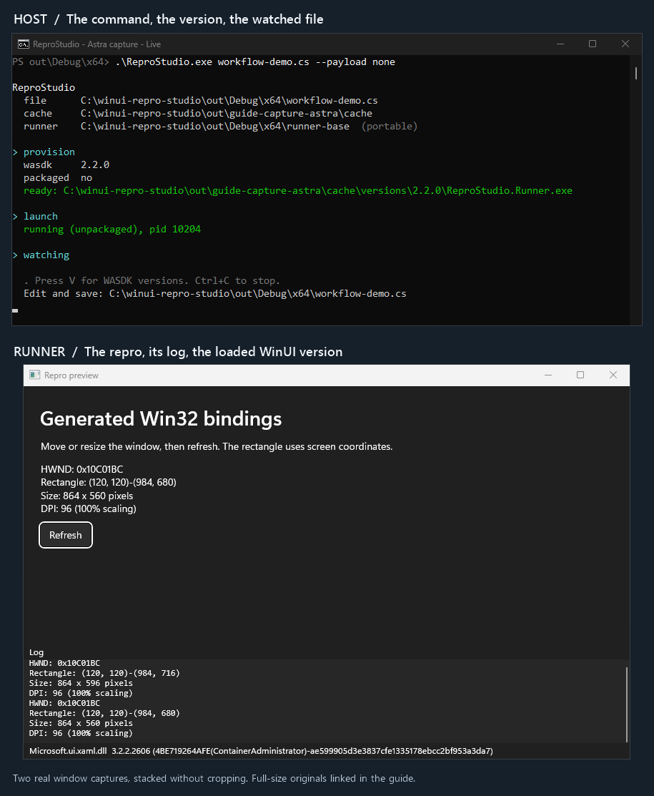

# ReproStudio

A small tool for reproducing WinUI / Windows App SDK bugs. Run one `.cs` file,
edit it, and save to refresh a live preview. Change the runtime version or drop
in a private DLL without rebuilding the tool.

SDK/API and native runtime can also be selected separately: compile against one,
run on another. They match by default; see the
[SDK/runtime guide](docs/guide.md#sdkapi-and-runtime) for compatibility repros.

## Run from source

On **Windows 10 1809 or newer**, install the
[.NET 10 SDK](https://dotnet.microsoft.com/download/dotnet/10.0).
From this checkout's root:

```powershell
dotnet run
```

This builds the host **and** Runner, then opens the hello sample. Look for
**Edit and save** in the console, change the heading in that file, and save.
**Ctrl+C** stops the session. No Visual Studio or `winapp` setup needed.

To run a source file directly, pass host arguments after `--`:

```powershell
dotnet run -- samples\hello.cs
dotnet run -- samples\cswin32.cs --headless --no-watch --payload none
```

The second command saves `ReproStudio.png` in the working directory and exits.
The console names the capture backend and reports any XAML-only fallback.

## Run a portable bundle

Unzip a bundle, open PowerShell in its folder, and run:

```powershell
.\ReproStudio.exe
```

The target machine needs **no SDK, .NET, or Windows App SDK installation**.
First use downloads the selected runtime; later runs reuse the cache.
Developer Mode is only needed for `--packaged`. To make a bundle from source,
run `.\pack.ps1`.

Both paths use the same host-and-Runner workflow:

[](docs/guide.md#run-it-change-it-keep-the-pixels)

## Next steps

```powershell
dotnet run -- --list                 # available runtime versions
dotnet run -- --help                 # host options
dotnet run -- --doctor               # diagnose setup problems
.\tools\smoke.ps1                    # exercise the source-to-bundle workflow
```

In a bundle, replace `dotnet run --` with `.\ReproStudio.exe`.
The smoke script is for source checkouts.
Press **V** while watching to list versions without closing the preview.
The first source build and uncached runtime provisioning need NuGet access.

**Only run repros you trust.** Their C# runs with your permissions, with no sandbox.

[Guide and visual walkthrough](docs/guide.md) |
[Samples and file format](samples/README.md) |
[Code map and internals](docs/how-it-works.md)
