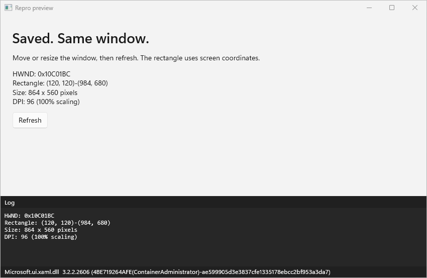
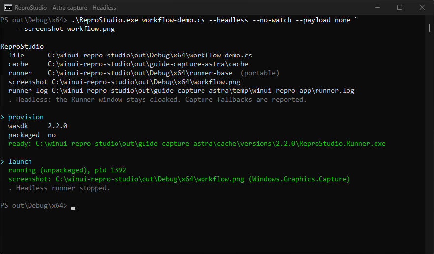
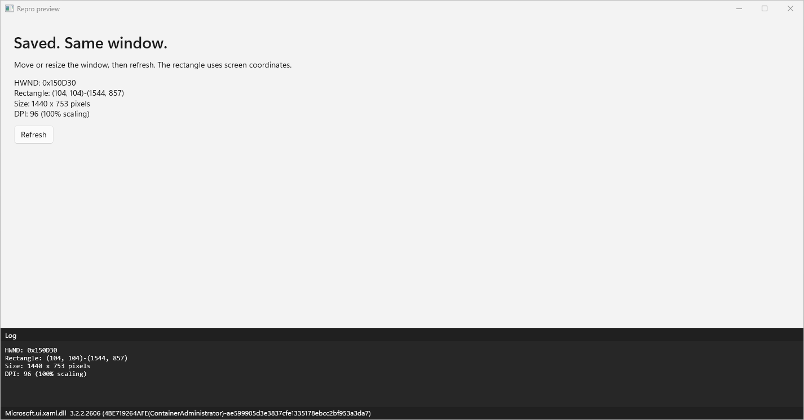

# ReproStudio guide

Everything past the quick start: taking it to another machine, testing your own
builds, and writing repro files.

Back to the [README](../README.md).

## Pick a task

| I want to... | Go here |
|---|---|
| Run or change the tool from source | [Build and run](#build-and-run-from-source) |
| See the edit/save loop | [Visual walkthrough](#run-it-change-it-keep-the-pixels) |
| Choose APIs and native runtime separately | [SDK/API and runtime](#sdkapi-and-runtime) |
| Pin, edit, or switch runtime from the preview | [Runner toolbar](#runner-toolbar) |
| Test a private DLL | [Payload folder](#test-a-private-build-the-payload-folder) |
| Save a screenshot | [Headless runs and screenshots](#headless-runs-and-screenshots) |
| Diagnose a failed run | [Troubleshooting](#when-something-fails) |
| Find the code behind a feature | [Code map](how-it-works.md#where-to-change-what) |

## Run it. Change it. Keep the pixels.

One file, two windows. The command window picks the runtime and watches your
file. The WinUI Runner draws it. Here's the whole loop.

### 1. Run a copy

From the built or unzipped folder containing `ReproStudio.exe`:

```powershell
Copy-Item samples\cswin32.cs workflow-demo.cs
.\ReproStudio.exe workflow-demo.cs --payload none
```

From the repository root, the same loop is `dotnet run -- samples\cswin32.cs
--payload none`. Use `--` to separate host arguments from `dotnet run` options.

[](images/workflow-overview.png)

*Two separate, real captures stacked for reading, not a desktop screenshot.
Full-size originals: [command window](images/workflow-host.png) /
[Runner](images/workflow-runner.png).*

Read from top to bottom: **wasdk** is the selected package version; **running**
names the Runner PID; **Edit and save** points to your file. The Runner's footer
shows the native WinUI version actually loaded, which is a different version number.

Try moving or resizing the Runner, then click **Refresh**. This sample uses
generated Win32 bindings for `GetWindowRect` and `GetDpiForWindow`. Its new
measurements appear in both the repro and the log.

### 2. Save an edit, not a new process

In `workflow-demo.cs`, change the heading `Generated Win32 bindings` to
`Saved. Same window.` and add `// theme: Light` near the top. Save the file.
No second launch command. No rebuild.

<details>
<summary>See the live change: new heading, Light stage, same window handle</summary>

[](images/workflow-reload-runner.png)

*The heading and stage theme changed. The HWND stayed `0x10C01BC`, and the
Runner PID stayed `10204`. Only the repro stage switches to Light; the
Runner's log keeps its own theme.*

The [host's reload capture](images/workflow-reload-host.png) shows **pushed**,
not another launch.

</details>

Ordinary XAML and C# edits update in place. A launch-time change, such as
another `// wasdk:` version, instead prints **relaunching** and starts the
matching Runner.

### 3. Save a PNG without the pop-up

Press **Ctrl+C** to stop the live session, then run:

```powershell
.\ReproStudio.exe workflow-demo.cs --headless --no-watch --payload none `
    --screenshot workflow.png
```

The Runner renders while its window stays cloaked and saves `workflow.png`
in your current directory. The host reports the capture backend and stops
the Runner. No visible preview to dismiss.

<details>
<summary>See the real command, completion, and saved PNG</summary>

[](images/workflow-headless-host.png)

*This run used **Windows.Graphics.Capture** and exited successfully. The
console names the output path and confirms that the hidden Runner stopped.*

[](images/workflow-headless-result.png)

*Above is the saved file, not an open window. This one-shot run used a new
Runner at its default size, so its HWND and measurements differ from the live run.*

</details>

Check your own backend line: `Windows.Graphics.Capture` captures the window;
a reported `RenderTargetBitmap` fallback captures only XAML. See
[headless runs and screenshots](#headless-runs-and-screenshots) for the limits.

Capture setup: a disposable copy of `samples\cswin32.cs`, a warmed stock cache,
and compact live windows. For clean demo paths, these processes used
`REPROSTUDIO_CACHE=out\guide-capture-astra\cache` and
`TEMP`/`TMP` under `out\guide-capture-astra\temp` (absolute paths under this
checkout). You don't need those settings. Your paths, PIDs, handles, and
version numbers will differ.

## Runner toolbar

The preview's toolbar is outside your repro's XAML:

- **Pin** toggles Windows' actual always-on-top state. It is a user preference,
  not repro content: saves and legacy `// topmost:` comments do not affect it.
  The last saved choice is shared across Runner versions and launches in
  `<cache-root>\runner-preferences.json`. The default cache root is
  `%LOCALAPPDATA%\winui-repro-app`; `REPROSTUDIO_CACHE` can isolate it.
  `--clear-cache` does not delete this preference. Headless Runners stay
  non-topmost without changing the saved choice.
- **Open in VS Code** opens the original `.cs` path printed by the host, including
  the bundled hello sample when no file was specified. Stable Visual Studio Code
  must be installed in its standard user/system location, registered under App
  Paths, or have `Code.exe` on PATH. The tool launches that executable directly,
  not `code.cmd` or your default editor. Missing files/installations show errors.
- **Runtime: ...** opens a searchable dialog. Choose **Windows App SDK** *or*
  **WinUI**, select one version, then **Apply and restart**. Stable versions are
  shown by default; **Include prereleases** is optional. In WinUI mode, **Browse**
  selects a local `.nupkg` instead of a published version. It uses the existing
  content-keyed package cache; it does not watch or invalidate private packages.
  A mixed initial CLI configuration is identified explicitly, but the dialog
  can only apply one choice.

The **SDK / C# API** choice is separate from that native-runtime choice. Leave it
matched for ordinary repros, choose a Windows App SDK API version for compatibility
work, or choose **Bundled API (base)** to keep the base Runner's APIs.
See [SDK/API and runtime](#sdkapi-and-runtime).

Cancel, searching, filtering, and changing the radio choice do not save or restart.
On Apply, the watching host uses the repro's `nuget.config` and prepares the
pair before changing the source or stopping the old preview. It removes every
leading `wasdk` and `winui` header and inserts exactly the selected one in the
**original repro**, and writes the `sdk` choice (or removes it for `match`).
Other comments/code, BOM and newline style stay intact.
UTF-8 and BOM-marked UTF-16/UTF-32 are supported; undecodable files are rejected,
not silently converted. If the source changed since that preview was sent,
changes during preparation, or cannot be written, the operation fails with a
retry message. Reopen Runtime after the saved file refreshes the preview.
Source commit uses a brief exclusive file lock; an editor may need to retry a save
that happens at exactly that instant.

Accepting a choice deliberately retires startup `--sdk`, `--wasdk`, and `--winui`
overrides for that host session, so the new headers win on later saves too.
Advanced command-line dual overrides still work on a new launch. Other options,
including payload and package identity, keep their existing semantics. The
footer always reports the native WinUI DLL actually loaded, not a pending choice.

Runtime changes need a live watching host and are disabled with `--no-watch`
or after the host exits. Pin and Open in VS Code still work in a visible one-shot
Runner. Toolbar errors have their own message area and log entries; they do not
replace a repro's render error.

## Take it to another machine

```powershell
.\pack.ps1
```

That produces `out\ReproStudio-x64.zip`. Unzip it anywhere on the target
machine and run it. The zip includes the samples, this `docs` folder, and
`README.md`, so the guide and its relative links are available offline:

```powershell
.\ReproStudio.exe
```

The target machine needs **nothing installed** - no SDK, no .NET runtime, no
Windows App SDK runtime. It does need internet on first use, because packages are pulled
from NuGet on demand. The tool's floor is **Windows 10 1809 (build 17763)**.
A selected SDK/runtime or the APIs in your repro can require a newer OS.

If something doesn't work, ask it:

```powershell
.\ReproStudio.exe --doctor
```

That prints the OS build, whether it clears the 17763 floor, where the base runner
came from, what's in the cache, and whether Developer Mode is on.

## CLI options

```powershell
.\ReproStudio.exe [file.cs] [options]
```

From a source checkout, use `dotnet run -- [file.cs] [options]` instead.
For example, `dotnet run -- --help` shows the host's help; `dotnet run --help`
shows the .NET SDK's help.

Without a file, launch commands use `samples\hello.cs` relative to the executable,
not the working directory. For example, `.\ReproStudio.exe --wasdk 2.2` opens the
default sample on that version. `--help`, `--list`, and `--doctor` remain
standalone commands and do not launch a preview.

| Option | What |
|---|---|
| `--sdk <version\|match\|base>` | Managed C# API/SDK selection. `match` (default) follows the runtime source; an explicit WASDK version selects its APIs; `base` keeps the bundled API surface. |
| `--wasdk <version>` | WASDK version. Partial is fine (`2.2` picks the newest 2.2). Overrides the file header. |
| `--winui <ver\|path>` | Override just the WinUI component: a version, or a local `.nupkg`. |
| `--payload <dir>` | Copy every file in `<dir>` over the runner. The quick way to test a private build. `none` disables it. |
| `--packaged` / `--unpackaged` | Force package identity on or off. |
| `--prerelease` | Include prerelease versions when resolving and listing. |
| `--headless` | Cloak the Runner and save `ReproStudio.png` in the invoking working directory after each render. |
| `--screenshot <path.png>` | Choose a screenshot path, relative to the invoking working directory. Also works without `--headless`. |
| `--no-watch` | Skip watching. With headless capture, wait for the image and stop the Runner; otherwise leave the visible Runner running. |
| `--provision-only` | Prepare the runner, then exit without launching. Warms the cache. |
| `--clear-cache` | Delete provisioned runners first (downloads are kept). |
| `--list` | List available WASDK versions and exit. |
| `--doctor` | Print environment diagnostics and exit. |

Set `REPROSTUDIO_CACHE` to move downloads and provisioned runners off
`%LOCALAPPDATA%`.

While it's watching, saving the file pushes the change. Editing a *launch-time*
header key (`sdk`, `wasdk`, `winui`, `payload`, `packaged`, `dpi`) re-provisions and relaunches
instead. If the runner dies on its own, the console says so and prints whatever
the runner appended to its crash log.

Ctrl+C stops the runner and unregisters the package.

Package identity is shared per Windows user, so only one host can own packaged
mode at a time, even with separate caches. A second host reports the conflict
and falls back to unpackaged mode without replacing the first registration.

Press **V** in the watching console to list WASDK versions without restarting
the preview. Copy a listed version into the file's `// wasdk:` header and save.
The shortcut uses that repro's NuGet configuration and the launch's
`--prerelease` setting. Successful lookups are reused for the session.

The full **Edit and save** path is printed after startup, version lists, and
reloads, so the file to edit stays easy to find. A slow or failed version lookup
does not stop the preview or prevent edits from being pushed.

With redirected console input, use `.\ReproStudio.exe --list` in another
terminal instead. Add `--prerelease` to include previews. Neither shortcut changes
the repro file for you, and an explicit `--wasdk` argument still overrides its header.

## SDK/API and runtime

There are two versions to choose:

| Choice | Controls |
|---|---|
| **SDK/API** | The managed APIs C# can compile against and the projections the Runner loads. |
| **Runtime** | The native WASDK/WinUI implementation that executes those calls. |

Normally they match. For example, this selects the experimental APIs and their
matching native runtime:

```powershell
dotnet run -- my-repro.cs --wasdk 2.4.1-experimental --payload none
```

For a compatibility repro, choose the API surface explicitly:

```powershell
dotnet run -- my-repro.cs --sdk 2.4.1-experimental --wasdk 2.2.0 --payload none
```

Or keep both choices in the file:

```csharp
// sdk:   2.4.1-experimental
// wasdk: 2.2.0
```

That second combination can **compile** newer members such as `Window.Width`,
but calling an API absent from the older native runtime can still fail at
runtime. With an older SDK and newer runtime, the opposite applies: an API absent
from the chosen managed surface remains a compile error.

`--sdk match` (or no `sdk` header) matches the selected runtime source, including
a WinUI package selection. `--sdk base` explicitly uses the managed APIs shipped
in `runner-base`, preserving the original native-only-overlay behavior. It is an
escape hatch, not an automatic fallback after a failed SDK selection.

These are **Windows App SDK/API** versions, not versions of the .NET SDK or C#
language. Provisioning uses package assets; the target machine does not need
MSBuild or an installed .NET SDK. Each pair uses a separate Runner process and
cache identity. Unsupported combinations fail visibly instead of substituting
another API surface.

The base Runner binary still has a build-time SDK. That is distinct from the
managed SDK/API payload selected for a run and from the native runtime reported
by the WinUI footer.

## When something fails

Start with the environment report:

```powershell
# Source checkout:
dotnet run -- --doctor
# Portable bundle:
.\ReproStudio.exe --doctor
```

The host prints the repro path, chosen runtime, base Runner, and log path.
Read those before guessing which copy is running.

| Symptom | What to check |
|---|---|
| A host option shows .NET help or behaves strangely | Put host arguments after `--`: `dotnet run -- samples\hello.cs --wasdk 2.2`. |
| No preview, or a compile/XAML error | Keep the sample's class wrapper and `const string Xaml` literal. Read the error panel and printed Runner log. |
| The Runner is missing or seems stale | From source, use `dotnet run` without `--no-build`. For a bundle, re-extract the complete archive. |
| NuGet cannot be reached | Prepare the exact SDK/runtime pair online first. An unchanged cached pair can run offline; creating a new pair may need dependency-version lookups even if some packages are cached. |
| A private fix seems to affect a stock run | Check the printed payload path. Use `--payload none` for the stock baseline. |
| A new API gives a compile error | Check the SDK/API choice, not just the native runtime. A runtime DLL cannot add members to an older managed projection. |
| Packaged mode fell back | The warning names the actual mode. `--doctor` checks identity assets and Developer Mode; do not treat fallback as a packaged result. |

Saving a corrected file retries the preview. There is no need to restart the
host for an ordinary bad edit.

## Headless runs and screenshots

From the repository root:

```powershell
dotnet run -- samples\cswin32.cs --headless --no-watch --payload none
```

This cloaks the real Runner window, saves `ReproStudio.png` in the current
working directory, then stops the Runner. The PNG is not written beside the
executable or repro unless that happens to be the working directory. The CLI
prints the absolute image path, capture method, and Runner log path.

To keep watching, omit `--no-watch`. The initial render and each saved edit
produce a new image at the same path. Ctrl+C stops the hidden Runner.
To choose a path, add `--screenshot captures\bug.png`; relative paths are
resolved by the CLI, which creates missing parent folders, so packaged launches
use the same location.
`--screenshot` also works with a visible Runner. With visible `--no-watch`,
the CLI waits for the image but leaves the window open.

The preferred backend is **Windows.Graphics.Capture**, targeting the main
Runner HWND while it stays cloaked. This captures the composed window, including
the native frame when supplied by Windows; it does not re-render the XAML tree.
If it is unsupported or fails, the Runner reports the reason
and tries **RenderTargetBitmap** on the Runner's XAML root instead. A fallback
is labeled in the console and log: it is not presented as a full window capture.
Failure to write the requested file is an error, not a reason to silently
choose another folder. PNGs are replaced atomically after capture completes.

### Know which image you got

The completion line names the backend:

```text
screenshot: C:\my-repro\ReproStudio.png (Windows.Graphics.Capture)
```

| Backend | What the PNG contains |
|---|---|
| `Windows.Graphics.Capture` | The composed main Runner window, including its frame where available. Separate windows are not automatically combined into the image. |
| `RenderTargetBitmap` | A XAML-only snapshot. The console also explains why WGC could not capture it. This is not equivalent evidence for a native/composition bug. |

Render failures are reported even if the error panel can be captured.
One-shot capture returns `1` for render/capture failure,
an early crash, or no completed result within 60 seconds. An older PNG may
remain after a failed capture; the CLI will not report it as a new success.
Watching stays alive after a bad edit so saving a correction can recover.

Errors, fallback reasons, and calls to `Log(...)` also go to the existing
Runner log, not a new log in the working directory:

```powershell
Get-Content "$env:TEMP\winui-repro-app\runner.log" -Tail 50
```

Use a different `--screenshot` path for each concurrent run so their images
do not overwrite each other.

### Capture limits

- HWND-based Windows.Graphics.Capture needs Windows 10 1903 or newer.
  Windows 10 1809 uses the explicitly reported XAML fallback.
- RenderTargetBitmap captures the preview, error panel, log, and footer, but
  excludes the native frame, disconnected popups, and unsupported non-XAML content.
- A window capture is not necessarily identical to final desktop pixels.
  For DWM frame, border, transparency, or foreground/focus investigations,
  use a visible run and an actual desktop capture.
- Headless cloaks the main Runner HWND, not additional windows that arbitrary
  repro code creates or shows in `OnProcessLaunch`. It is not a sandbox.
- Cloaked does not mean a desktop-free rendering service. A working graphical
  session is still needed; disconnected or non-rendering VM sessions can fail.
- Images are taken after render requests, not continuously as animations,
  asynchronous work, or interactions change the app.

**Known issue:** WGC can occasionally return the previous scene after a headless
live reload, even with a successful, current request ID. Inspect the actual PNG
before using it as evidence. The smoke script checks pixel changes across repeated
saves; `-RequireWgc` also prevents a XAML-only fallback from passing that check.
This capture issue remains a separate follow-up.

## Test a private build: the payload folder

Provisioning assembles the base Runner, selected managed SDK/API files, and
selected native runtime. The payload folder adds one more copy on the end,
so testing a private build of `Microsoft.ui.xaml.dll` is a matter of dropping the
file somewhere and running:

```powershell
.\ReproStudio.exe samples\hello.cs --payload D:\my-winui-build
```

Native files in that folder win over stock files of the same name. Files keep
their relative paths, so a subfolder like `Microsoft.UI.Xaml\` (the themes
directory) works the same as a loose DLL.

Three ways to point at one, in priority order:

| How | Example |
|---|---|
| `--payload <dir>` | `--payload D:\my-winui-build` |
| `// payload:` header | `// payload: ..\my-build` (relative to the repro file) |
| A `payload\` folder next to `ReproStudio.exe` | just run it |

That last one is why the packed bundle ships an empty `payload\` folder. Copy a
DLL in, run, and you are testing it. Nothing to configure.

The folder is watched, so rebuilding the DLL and copying it in relaunches the
repro on its own. Use `--payload none` to ignore the default folder for one run,
which is how you get a stock comparison without moving files around.

A few things worth knowing:

- Payload contents are part of the SDK/runtime pair's cache key, so
  runs without a payload keep using untouched stock bits.
- Changing the payload prepares a new pair rather than editing a running pair.
- `.txt` and `.md` files are ignored, so the folder can carry a README without
  that counting as content.
- Managed DLLs, Runner application files and `resources.pri` are rejected.
  Choose managed APIs with `--sdk`, not a loose-file overlay. Native compatibility
  is still your responsibility; a bad binary can fail to load.

**Always take a stock reading before you trust a payload reading.** If the
private build changes nothing, that's worth knowing; if it changes everything,
you want to be sure the harness itself was working.

### `--payload` or `--winui`?

Both put private bits in front of the runner. They solve different problems.

| | `--payload <dir>` | `--winui <ver\|path.nupkg>` |
|---|---|---|
| Input | Loose files | A version, or a built `.nupkg` |
| Best for | One rebuilt DLL, iterating fast | A full WinUI build you want to keep and share |
| Setup | Copy a file in | Build a nupkg first |
| Granularity | Native files and resources, preserving subfolders | The WinUI component and its dependencies |
| Knows what stack it needs | No | Yes, if the nupkg declares dependencies |

For a tight edit-build-test loop, use `--payload`. To hand someone a bundle that
runs a specific build, use `--winui`.

## Test a WinUI repo build

This is the path to use for a real WinUI build. In the WinUI repo:

```
build.cmd /version 3.9.9-mybuild
```

That produces a `Microsoft.WindowsAppSDK.WinUI.3.9.9-mybuild.nupkg` that declares
the Base, Foundation and InteractiveExperiences versions it was compiled against.
Point ReproStudio at it and it works out the rest:

```powershell
.\ReproStudio.exe bug.cs --winui D:\winui\...\Microsoft.WindowsAppSDK.WinUI.3.9.9-mybuild.nupkg
```

No `--wasdk` is needed. The package's dependency ranges choose the rest of the
stack. With the default `--sdk match`, its managed APIs and native files are
prepared together. The host prints both selections and the managed WinUI version.

### Why this matters

A newer WinUI build can require a Foundation interface missing from an older
stack. A loose native overlay can then fail with `E_NOINTERFACE` or an
`InvalidCastException`. Resolving the package's declared dependencies avoids
guessing that stack. It does not guarantee that every private build is compatible.

### Mixing both flags

Pass `--wasdk` too and you get a middle ground:

```powershell
.\ReproStudio.exe bug.cs --wasdk 2.2.0 --winui 2.3.0
```

The WASDK package supplies the broader stack, while the explicit WinUI package
replaces its WinUI choice. Shared dependency ranges must all be satisfied,
including upper bounds; conflicts are errors, not permission to silently use an
incompatible version. `--sdk match` follows this combined graph. An explicit
`--sdk <version>` still chooses the managed API graph independently.

### Packages with no dependency metadata

`tools\pack-local-winui.ps1` produces a shape-only nupkg. It has the right folder
layout but no nuspec, so it cannot supply matched managed APIs or decide a stack.
Supply both a native WASDK version and an API choice:

```powershell
.\ReproStudio.exe bug.cs --wasdk 2.2.0 --sdk base --winui D:\private\shape-only.nupkg
```

Use an explicit `--sdk <version>` instead of `base` when newer APIs are needed.
The shape-only package remains a native overlay, not the source of those APIs.

### NuGet sources

ReproStudio uses your real NuGet configuration, so an internal feed just works.
Drop a `nuget.config` next to the repro file to add one for a single repro:

```xml
<configuration>
  <packageSources>
    <add key="winui-pr" value="https://pkgs.dev.azure.com/.../nuget/v3/index.json" />
  </packageSources>
</configuration>
```

`--doctor` lists the sources it found. If a version cannot be fetched, the error
names the package, the version, and every source it tried.

## Write a repro file

Start by copying [`samples/hello.cs`](../samples/hello.cs). A repro is an ordinary
C# file with optional `// key: value` headers, a required `Xaml` string literal,
and an optional `Setup` method:

```csharp
// repro: My cool bug
// wasdk: 2.2

class Repro
{
    const string Xaml = """
        <StackPanel xmlns="http://schemas.microsoft.com/winfx/2006/xaml/presentation"
                    xmlns:x="http://schemas.microsoft.com/winfx/2006/xaml"
                    Padding="24" Spacing="12">
            <TextBlock Text="Hello from a file!" FontSize="28" />
            <Button x:Name="HelloButton" Content="Click me" />
        </StackPanel>
        """;

    static void Setup(FrameworkElement root, Window window)
    {
        Log("Loaded from file.");
        if (root.FindName("HelloButton") is Button button)
        {
            button.Click += (s, e) => button.Content = "Clicked!";
        }
    }
}
```

Keep the class wrapper: snippets compile as a library, so top-level statements
fail with `CS8805`. The runner imports common WinUI namespaces for you.

Every header key is optional. See the [file format](../samples/README.md#the-format-in-one-breath)
for all keys and which ones update live or restart the runner.

**Only run repros you trust.** The Runner compiles and runs their C# with your
permissions and no sandbox.

Two more folders hold repro files with a job to do:

| Folder | What's in it |
|---|---|
| [`probes/`](../probes/) | One-file checks that settle a single question about platform behaviour, each with its measured answer and the WASDK version it was taken against |
| [`investigations/`](../investigations/) | Bigger measurement harnesses written to chase a specific bug, each with a write-up of what it found |

### Run code before XAML starts

The console host recognizes one optional launch-time hook:

```csharp
static void OnProcessLaunch()
{
    EnableXamlOptionalChange(63530879);
}
```

At the CLI's request, the Runner compiles and invokes this parameterless
`static void` method before `Application.Start`, so it can configure process-wide
state that must be set before XAML initializes. `EnableXamlOptionalChange` takes
the numeric `XamlChangeId`, which
also works when the selected managed projection predates that enum member.

Changing `OnProcessLaunch` changes the CLI's launch plan and restarts the Runner.
Edits elsewhere, including XAML and `Setup`, still update the existing process.
The hook is compiled separately from `Setup`, so use it for process-wide/native
configuration rather than managed static state that `Setup` expects to read. Keep
the exact block-bodied `static void OnProcessLaunch()` shape and keep its launch
configuration self-contained: only this method's text is fingerprinted, so changing
a helper or constant outside it does not trigger a relaunch.

### You don't have to type the whole WASDK version

`wasdk: 1.7` is enough. It matches your text against the real version list by
dotted segments and picks the newest one that fits, so `1.7` finds
`1.7.250401001`. An exact version skips the top-level version lookup. Preparing
a new pair may still need feeds to resolve dependency ranges. For offline use,
prepare the pair first and keep the base Runner, selections and payload unchanged.

### Packaged mode needs Developer Mode

`packaged: yes` (and `--packaged`) registers the provisioned runner folder as a
loose-layout package. Windows only allows that when Developer Mode is on:
**Settings > Privacy & security > For developers**. Without it you get
`0x80073CFF`, and the console falls back to an unpackaged launch with a warning.

### Your own usings, and P/Invoke

The runner hands your whole file to Roslyn after prepending a fixed block of
usings, so you can add your own directives and they land in the right place.
Repeating one that's already injected is a warning, not an error, so
`using System;` at the top of your repro is fine.

Injected for free:

```
System                                 Microsoft.UI.Xaml.Media
Microsoft.UI.Xaml                      Microsoft.UI.Xaml.Shapes
Microsoft.UI.Xaml.Controls             Microsoft.UI.Xaml.Input
Microsoft.UI.Xaml.Controls.Primitives  Microsoft.UI.Windowing
Windows.Graphics                       static ReproStudio_Runner.ReproApi
```

That means `[DllImport]` works for repros that need Win32.
Take the `Window` that `Setup` hands you and turn it into an HWND:

```csharp
using System.Runtime.InteropServices;
using WinRT.Interop;

class Repro
{
    const string Xaml = """<TextBlock xmlns="http://schemas.microsoft.com/winfx/2006/xaml/presentation" Text="hi" />""";

    [DllImport("user32.dll")]
    private static extern int GetWindowLong(IntPtr hwnd, int index);

    static void Setup(FrameworkElement root, Window window)
    {
        IntPtr hwnd = WindowNative.GetWindowHandle(window);
        Log($"ex-style 0x{GetWindowLong(hwnd, -20):X8}");
    }
}
```

A fuller example, calling `DwmExtendFrameIntoClientArea`, is in
[`samples/pinvoke.cs`](../samples/pinvoke.cs).

For generated bindings instead, put this before the first `using` or class:

```csharp
// win32: GetWindowRect, GetDpiForWindow
```

CsWin32 generates `Windows.Win32.PInvoke` and its supporting types directly in
the snippet assembly. Add `using Windows.Win32;` and, for `HWND`/`RECT`,
`using Windows.Win32.Foundation;`. The Runner supplies `NativeMethods.txt` in
memory; no per-repro project or on-disk API list is necessary. Repeated headers
merge comma-separated names, and changes regenerate on save. Unknown names and
generator warnings/errors fail visibly. Only the leading comment header is read.
The generator, dependencies and Win32 metadata ship with the Runner, so generation
does not need an SDK, NuGet cache or network (WASDK provisioning still may).
Generated code supports unsafe declarations and targets the Runner's x64, x86
or ARM64 architecture. API availability on the target OS remains your responsibility.

Run the rectangle/DPI demo from the repository root:

```powershell
dotnet run -- samples\cswin32.cs
```

See [`samples/cswin32.cs`](../samples/cswin32.cs) and the
[header rules](../samples/README.md#writing-your-own). Add `--payload none`
for a stock runtime, ignoring any private payload beside the executable.

One limit worth knowing: the runner paints its own opaque stage over the client
area, so Win32 calls that rely on client-area transparency (DWM glass, layered
windows) will return `S_OK` and change nothing you can see.

## Build and run from source

From the repo root:

```powershell
dotnet run
dotnet run -- samples\hello.cs
```

The first command opens the default hello demo; the second watches the source
sample rather than the copy under `out`. Both build the real host and its
build-only Runner dependency before launch.

Use `dotnet build` to build without opening anything. The root
`ReproStudio.csproj` is the host project, not a wrapper; its source remains under
`src\ReproStudio.Cli`. The same-named solution keeps bare solution builds working.

The projects write directly into the runnable layout:

```text
out\Debug\x64\
    ReproStudio.exe
    runner-base\
        ReproStudio.Runner.exe
    samples\
    probes\
    investigations\
    payload\
```

Use `dotnet build -c Release` for `out\Release\x64`, or add
`-p:Platform=ARM64` / `-p:Platform=x86` to target another architecture. Solution
and root project builds use the same paths. For example:

```powershell
dotnet run -c Release -- samples\hello.cs
dotnet build ReproStudio.csproj -p:Platform=ARM64
```

`dotnet run --no-build -- samples\hello.cs` deliberately skips the build.
Use it only when the selected configuration/platform is already current.

Use the `dotnet` CLI (SDK 10.x), not VS2022's MSBuild, which resolves an older
SDK and fails on net10 with NETSDK1045.

Saving a source repro under `samples\` updates the live preview when running it
by its source path, as above. The output folder also carries copies of the sample
files; rebuild to refresh those copies. The build leaves private files you drop
into `payload\` alone.

**After a Runner change, build and run from this output folder.** No packing or
manual copy is needed. Old exes under `bin\` and previously packed bundles are not
updated. The console prints the base it chose:

```
runner    ...\out\Debug\x64\runner-base  (portable)             <- fresh
runner    ...\AppData\Local\winui-repro-app\runner-base  (dev)    <- may be old
```

Use `.\pack.ps1` for a Release zip to share. It uses the same solution build,
then copies the built app and the current source repros for distribution.
Local edits or extra repros in the build output are not included. `-NoZip` skips
compression; private DLLs in the development output's `payload\` are not included.

### Check the main workflow

```powershell
.\tools\smoke.ps1
```

The smoke script uses the existing .NET SDK and Windows/PowerShell tools, not
a test framework. It builds into a private output folder and uses a separate
runtime cache, so an old working Runner cannot hide a broken first-run path.
It covers argument forwarding, the default sample, save/reload, invalid code,
headless PNG output, and the portable bundle. A cold run needs NuGet access and
a working graphical session.

Failures return a nonzero exit code and print the artifact/log location.
See `Get-Help .\tools\smoke.ps1 -Detailed` for targeted runs and artifact options.
